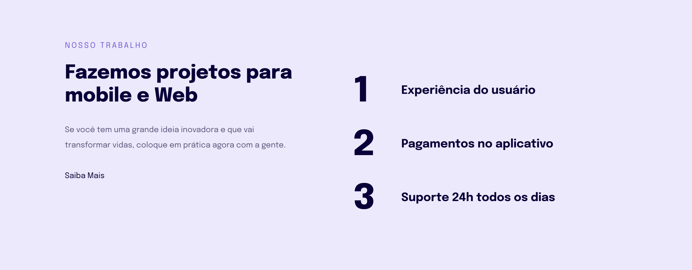
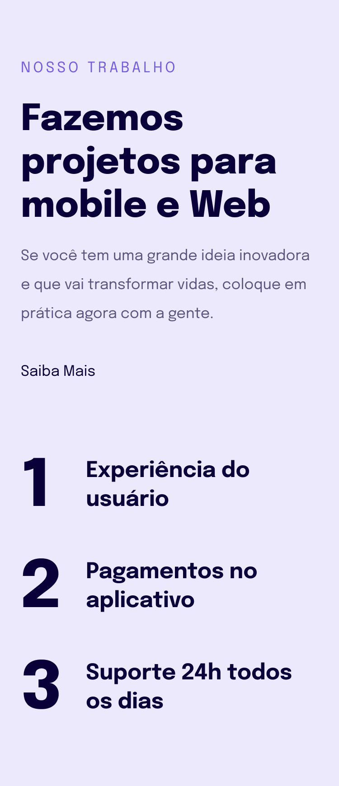

# Explorer Project 4

## Overview

**Explorer Project 4** is a hands-on project designed to provide a deep dive into the world of responsive web design, with a specific focus on the mobile-first approach and the use of relative units (like `rem`) in CSS. This project is an excellent opportunity for learners to understand why and how to build websites that adapt seamlessly to various screen sizes, from mobile devices to desktops.




### Learning Objectives

- **Responsiveness:** Learn the fundamentals of responsive web design, ensuring that web applications function effectively on different devices.
- **Mobile-First Design:** Understand the importance of designing for mobile devices first, then scaling up to larger screens.
- **CSS Units:** Explore why `rem` units are preferred over `px` for font sizes to maintain scalability and accessibility.

### Design

The project follows a specific design, as outlined in the Figma file. You can view the design and layout details here:

[Explorer Stage 03 - Project 02 Design](<https://www.figma.com/file/qKHbD2onwHzN04CwgAuGuS/Explorer-Stage-03-Projeto-02-(Copy)?node-id=203%3A412&mode=dev>)

### Project Structure

The project consists of the following main files:

- `index.html`: The HTML structure of the project.
- `style.css`: The styling rules applied to the project, following the CSS best practices for responsiveness.

### Cloning the Project

To clone this project, use the following Git command:

```bash
git clone https://github.com/giovannivicentin/explorer-project-4
```

This will create a copy of the project on your local machine.
